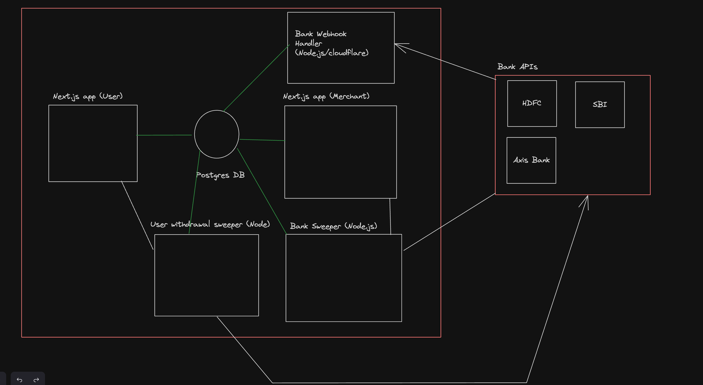

# Blink Wallet

Blink Wallet is a versatile digital payment solution designed to simplify your financial transactions. With Blink Wallet, you can store money electronically and enjoy quick, secure payments for a variety of services, including utility bills, mobile recharges, online shopping, and in-store purchases.

# Features

  1. Top up your wallet using your bank provider.
  2. Make secure payments with a transaction locking mechanism that prevents any falsified transactions.
  3. Transfer money peer-to-peer using just the recipient's phone number.

# Future Objectives

Build a merchant app providing businesses with robust tools to manage sales and transactions, process payments securely.
  

## Installation

Install the dependencies:
```sh
  npm i
```


Migrate the database:
```sh
  npx prisma migrate dev
  npx prisma generate
```

Run the server
```sh
  npm run dev
```
Below are the port mappings for the apps respectively:
```sh
  -merchant-app:  PORT 3000
  -user-app:      PORT 3001
  -bank-webhook:  PORT 3003
```
## Architecture



# Usage

## Top Up Wallet

1. Open the Blink Wallet app.
2. Navigate to the 'Top Up' section.
3. Select your bank provider and enter the amount you wish to add to your wallet.
4. Confirm the transaction to complete the top-up process.

## Make Payments

1. Access the 'Payments' section in the Blink Wallet app.
2. Choose the service or bill you want to pay (e.g., utility bills, mobile recharge).
3. Enter the necessary details such as recipient information and payment amount.
4. Use the transaction locking mechanism to confirm and secure your payment.

## Transfer Money

1. Go to the 'Transfer' feature within Blink Wallet.
2. Enter the recipient's phone number associated with their Blink Wallet account.
3. Input the amount you want to transfer.
4. Verify and confirm the transaction to send money securely.

# Security

Blink Wallet prioritizes your security with advanced encryption methods and a robust transaction locking mechanism. This ensures that all your financial transactions are secure and protected against unauthorized access and fraud.


# Contributing

We welcome contributions from the community to improve Blink Wallet. Please review our guidelines for contributing and follow these steps to contribute:

1. Fork the repository on GitHub.
2. Create a new branch for your feature (`git checkout -b feature/feature-name`).
3. Commit your changes (`git commit -am 'Add new feature'`).
4. Push to the branch (`git push origin feature/feature-name`).
5. Create a new Pull Request on GitHub.

# License

Blink Wallet is licensed under the MIT License. See the [LICENSE](LICENSE.md) file for more details.

# Acknowledgements

We extend our gratitude to all contributors and supporters who have helped make Blink Wallet a robust digital payment solution.


